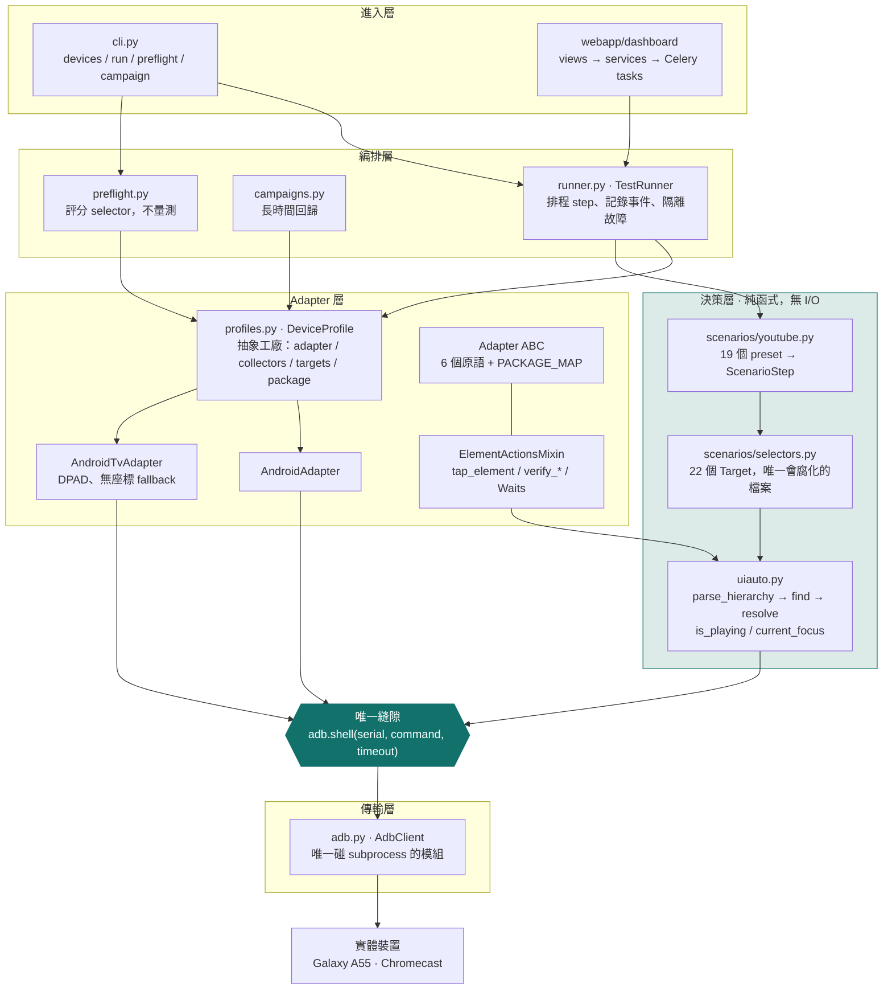
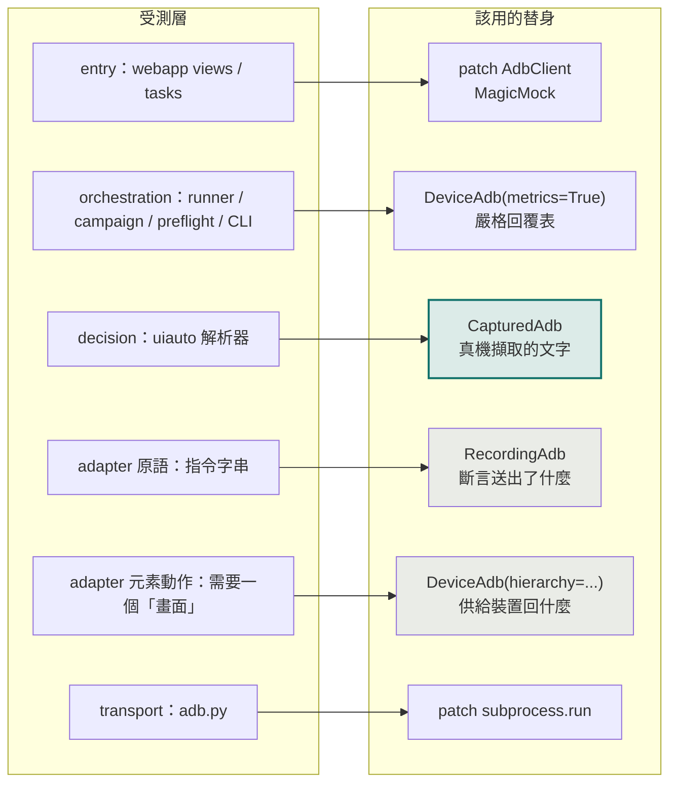
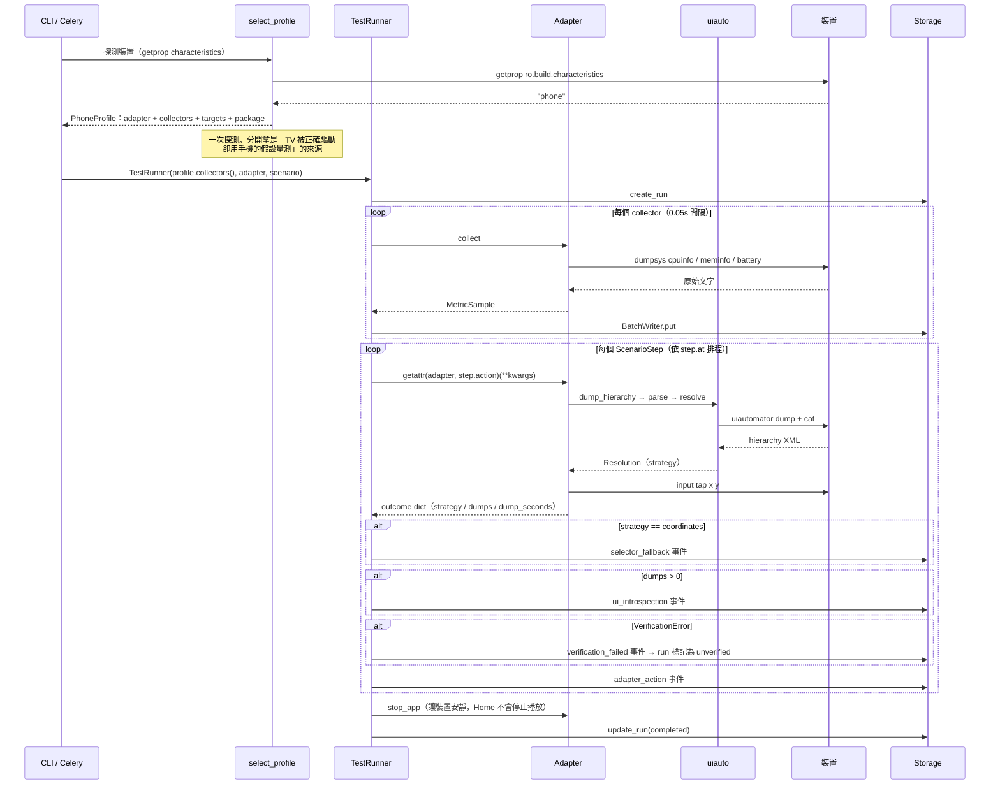
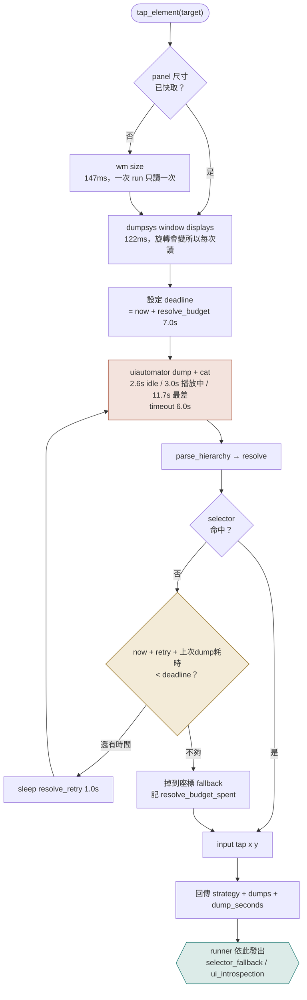
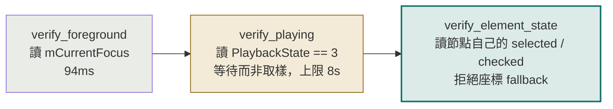
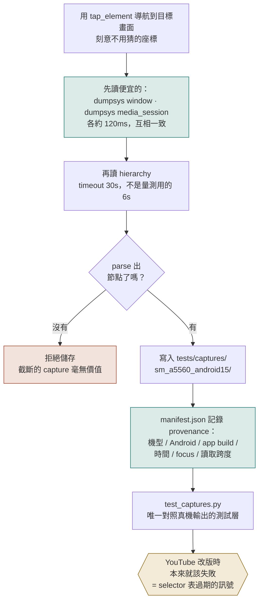
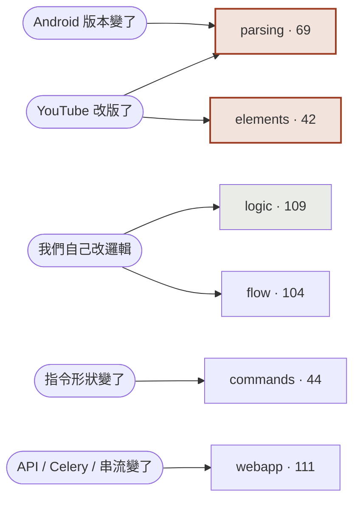

# AutoPerf 裝置測試架構與設計哲學

> 量測基準：Galaxy A55（SM-A5560）／Android 15／YouTube 21.29.366／adb over USB／五次取中位數
> 測試規模：368 core + 111 webapp

---

## 一、為什麼需要這份文件

這套測試的失效模式**從來不是 flaky，而是「自信的綠燈」**。

以下是專案最近五個實質修正。右欄是「當這個 bug 還活著的時候，測試套件說了什麼」：

| 缺陷 | 測試套件 |
|---|:--:|
| `dumpsys media_session` 的 regex 只認舊格式 → `is_playing` 在所有現代裝置上回 `None` → **系統裡最強的檢查靜默地什麼都沒驗證** | 🟢 綠燈 |
| 19 個 selector label 全是猜的，而且錯 | 🟢 綠燈 |
| 搜尋流程點了搜尋框就去點「建議」的位置，**從來沒有打字** → 七個 scenario 從未進到影片 | 🟢 綠燈 |
| `screen_size` 沒考慮旋轉 → 所有比例座標都用直向尺寸計算 | 🟢 綠燈 |
| TV adapter 拿 scenario 的套件名比對實際啟動的 `.tv` 套件 → 每次 run 都 unverified | 🟢 綠燈 |

**五個都是在真機上發現的，沒有一個是測試抓到的。**

> 一套無法為「系統真正會壞的原因」而失敗的測試，不是安全網，只是第二個要維護的東西。

---

## 二、分層架構

整個裝置層只有**一個出口**：`adb.shell(serial, command, timeout)`。這是這個 codebase 最好的一個決定 —— 368 個測試能在沒有裝置的情況下跑完，全靠它。



**關鍵設計：決策層是純函式。** `uiauto.py` 只把文字變成決定，I/O 全留在 adapter。selector 邏輯之所以可測，完全靠這條線（Humble Object 模式）。

---

## 三、測試替身掛在哪一層

測試作者**只需要決定「我測哪一層」**，替身就跟著定下來 —— 不靠記憶。



三個替身，職責刻意分開：

| 替身 | 職責 | 為什麼不能合併 |
|---|---|---|
| `RecordingAdb` | 斷言**送出了什麼**（Spy） | 與下者職責相反；合併會讓每個測試都要設定兩半 |
| `DeviceAdb` | 供給**裝置回什麼**（Stub） | 同時記 `dumps` 計數，因為成本是假物件唯一藏得住的東西 |
| `CapturedAdb` | 重播**真機擷取的文字** | 那份文字沒人寫過，這就是全部的意義 |

**嚴格是預設。** 未列出的指令會 raise。曾經有兩個同名 `FakeAdb`：一個 `KeyError`、一個靜默回 `""` —— 所以打錯的指令會不會讓測試失敗，取決於你在哪個檔案。現在寬鬆是一個顯式參數 `allow_unknown=True`。

---

## 四、一次量測 run 的流程



---

## 五、`tap_element` 的決策與預算

這張圖是**真機量測後才長成現在這樣**的。



### 為什麼是「時間預算」而不是「重試次數」

| | 修改前 | 修改後 |
|---|---|---|
| 停止條件 | `resolve_attempts = 3` | `resolve_budget = 7.0s`（次數降為上限） |
| 觀看頁最差耗時 | **25.5s**（3 次 dump，23.4s 在 dump） | **6.25s** |
| 對上 `adapter_action_timeout = 10.0s` | ❌ 步驟被殺掉 | ✅ 落在預算內 |

用中位數算：`3 × 3.0s + 2 × 1.0s = 11.0s > 10.0s`。也就是說，**那個「為了救『步驟比 app 畫完更早到』而存在的重試」，實際上是讓整個步驟被殺掉 —— 比不重試更糟。** 而原本沒有任何東西把這兩個數字連起來，這就是它們能互相矛盾的原因。現在有一個測試斷言 `resolve_budget < adapter_action_timeout`。

「還能不能再試一次」用**上一次 dump 自己的耗時**當估計，所以它會自我校準：dump 快的裝置跑滿三次，慢的裝置跑一次然後誠實掉座標。

---

## 六、三種驗證強度



| 檢查 | 能證明什麼 | 抓不到什麼 |
|---|---|---|
| `verify_foreground` | app 真的到前景（`am start` 只保證 intent 送出，不保證可用） | 首頁 feed 也會通過 |
| `verify_playing` | 影片**真的在播** —— 唯一能區分「search_and_play 成功」與「四次點擊打在空白處」 | 讚有沒有按下 |
| `verify_element_state` | 控制項自己的狀態 —— 唯一能證明「讚真的按下」而非「按鈕被找到並點了」 | 見下方限制 |

三者都是**三態**（`True` / `False` / `None`）。讀不到回 `None`，不當失敗。

---

## 七、Capture 流程：讓 fixture 從猜測變成證據



### 做這件事的過程本身教了兩課

**1. 錄錯畫面比沒錄更糟，因為它看起來像證據。**
第一次錄 `shorts` 時我用猜的座標點分頁、沒點中，結果把 **launcher** 存成了 `shorts`。manifest 記的 `focus` 欄位抓到了。重錄改用 `tap_element` —— 所以 selector 表必須有效，這個 capture 才會存在。

**2. capture 不是快照，是一段時間窗。**
hierarchy dump 要 2.6–11.7 秒，dumpsys 只要 120ms。原本先 dump 的順序，讓觀看頁的 capture 存下了「播放中的 hierarchy」配「`STOPPED` 的 media_session」—— 因為我用的 golden video 只有 19 秒，在 dump 期間播完了。現在便宜的讀取先做，跨度也記進 manifest。

### 最有價值的一行測試

```python
self.assertIs(uiauto.is_playing(CapturedAdb("watch_page_playing"), "S1", YOUTUBE), True)
```

這正是那個讓「系統裡最強的檢查」靜默什麼都不驗證的 bug。**手寫 fixture 永遠抓不到，真機文字一測就現形。**

---

## 八、測試分組：按「什麼情況下會壞」

按模組分只是把 src 目錄抄一遍。按失敗原因分，才回答得出維護者真正會問的問題。



| 群組 | 什麼時候會壞 | 測試數 |
|---|---|--:|
| `logic` | 我們自己的邏輯改了。**這裡不知道「裝置」是什麼** | 109 |
| `parsing` | 裝置吐的東西跟 fixture 假設的不一樣 ← fixture 都在這 | 69 |
| `commands` | 送出去的指令形狀改了 | 44 |
| `elements` | selector 解析或 `verify_*` 動作改了 | 42 |
| `flow` | 整條流程對假裝置跑不通 | 104 |
| `webapp` | API / Celery / 串流 | 111 |

只有 `parsing` 與 `elements` 會被 YouTube 改版打到。**整個套件近三分之一（`logic`）跟任何裝置都無關** —— 出事時值得先知道這件事。

```powershell
python scripts/run-tests.py            # 全部，一個指令（含 webapp）
python scripts/run-tests.py --list     # 有哪些組、各自何時會壞
python scripts/run-tests.py parsing    # 只跑會過期的那一片
```

**地圖不會爛掉**：測試模組不在任何組 → 「跑全部」會靜默跳過它 → `test_suite_groups.py` 失敗。在兩組 → 跑兩次卻讀成兩種風險 → 也失敗。

---

## 九、七條原則，每一條都用一個 bug 換來

| # | 原則 | 換來的代價 |
|:--:|---|---|
| 1 | **「不知道」不等於「失敗」** | 反面才致命：永不失敗的 `None` 等於沒驗證。所以第三態必須稀少、大聲、可區分 —— 要被記錄，不能被吞掉 |
| 2 | **靜默的成功比大聲的失敗更糟** | `input tap` 對空白處也回成功 → 錯失的點擊被記成「動作完成」，run 綠燈收場卻量了一個沒被碰過的畫面 |
| 3 | **等狀態，不要取樣** | 固定時間點的檢查，在快網路通過、慢網路失敗。真機上：直播還在緩衝就被判 not-playing |
| 4 | **用結構取代紀律** | 六個等待旋鈕只有兩個可注入，漏掉兩個的還是「坐在做對的類別旁邊」的測試。代價：87 秒裡的 61 秒 |
| 5 | **用空集合取代清單** | 清單會過期。改成斷言「沒有別的地方可以放等待」 |
| 6 | **斷言成本，因為假物件把它藏起來了** | dump 2.60s / 最差 11.66s，其他讀取 0.12s。一個效能工具用 12 次 dump 污染自己量的 CPU |
| 7 | **沒人擷取的 fixture 就是猜測** | 36 個手寫 fixture 與程式碼「天生一致」，所以永遠不可能反駁它 |

---

## 十、實測數據

### 每個 primitive 的成本

| 讀取 | 中位數 | 大小 | 備註 |
|---|--:|--:|---|
| `wm size` | 147ms | 25 B | 已快取：一次 run 內不會變 |
| `dumpsys window displays` | 122ms | 25 KB | 旋轉，每次動作重讀 |
| `dumpsys window` | 141ms | 69 KB | `verify_foreground` |
| `dumpsys media_session` | 121ms | 20 KB | `verify_playing` |
| `dumpsys cpuinfo` | 118ms | 8.8 KB | |
| `cat /proc/meminfo` | 105ms | 1.6 KB | |
| `dumpsys battery` | 113ms | 11 KB | |
| **`uiautomator dump` + `cat`** | **2611ms** | 27 KB | **其他所有讀取的 20 倍** |

### 三種看起來更便宜的 dump，實測後全部否決

| 做法 | 中位數 | 結論 |
|---|--:|---|
| `dump --compressed` | 2455ms | 快 6%，但 **72 節點變 27** —— 剪掉了 selector 需要的 view |
| `shell … /dev/tty` | 2331ms | 根本沒回 XML，只有一行狀態訊息 |
| `exec-out … /dev/tty` | 2546ms | 結束標籤後接了狀態訊息，**解析失敗** |

彼此都在 12% 內 —— 成本是「等 UI idle」而不是傳輸。**唯一有意義的優化是少 dump。**

### 啟動：deep link 兩項都贏

| | 指令返回 | app 真的到前景 |
|---|--:|--:|
| `monkey -c LAUNCHER` | 506ms | 0.95s |
| `am start -a VIEW -d <watch url>` | **115ms** | **0.57s** |

又快又確定 —— 這就是 `play_*` preset 才是 baseline 比較正確工具的原因（而且它們花 **0** 次 dump）。

---

## 十一、已知限制（誠實的部分）

- **只有一台裝置、一個 app build。** capture 全部來自 A55／Android 15／YouTube 21.29.366。換第二支手機一定會有幾條被推翻，而那個矛盾是目前沒人擁有的資訊。
- **沒有任何東西在 CI 上對真機跑。** 因為沒有 CI。`preflight` 是正確的想法 —— 一個真的走一遍並評分 selector 表的流程 —— 但它至今仍是「要有人記得去跑」的指令，不是一道關卡。
- **讚按鈕測不了。** 實測：`selected` 與 `checked` 點擊前後都不動，唯一變化的是**全站讚數**（兩次讀取間隔幾秒就變了 13）。所以機制存在、正確、但沒有東西給它指。**這是結論，不是缺口。**
- **播放器覆疊永久只能靠座標。** 全螢幕、畫質、進度條完全不在 accessibility tree 裡 —— 播放器自己畫。preflight 誠實回報它們掉座標，而不是假裝。
- **TV 端刻意暫停。** `AndroidTvAdapter.tap_element` 仍自己重寫 resolve 迴圈，所以重試修正到不了 TV；scenario 庫也還硬引用手機的 `selectors`。兩者都寫在 `profiles.py` 的 docstring 裡。

---

## 一句話總結

> **在某個測試套件之外的東西 —— 一台裝置、一次量測、一份擷取 —— 有機會反駁它之前，先假設它在說謊。**
