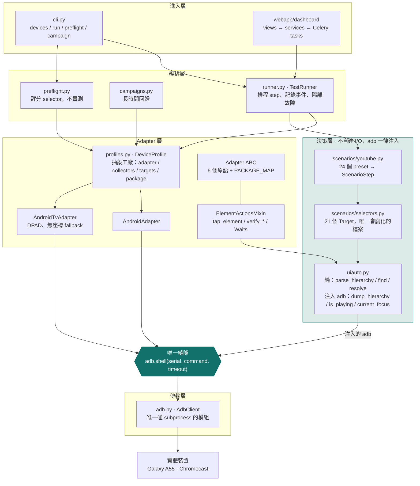
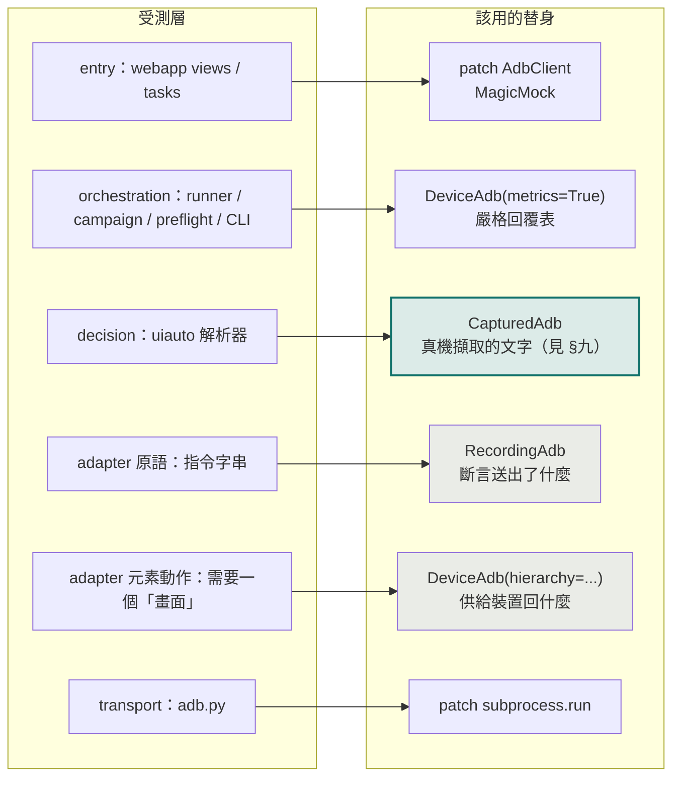
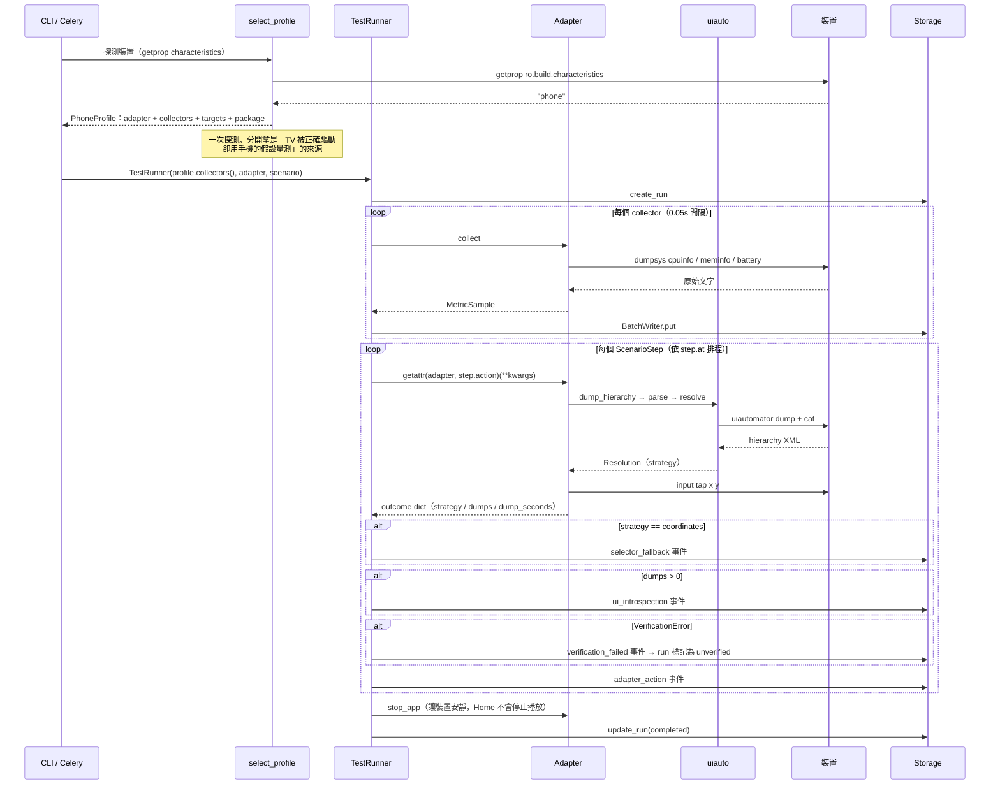
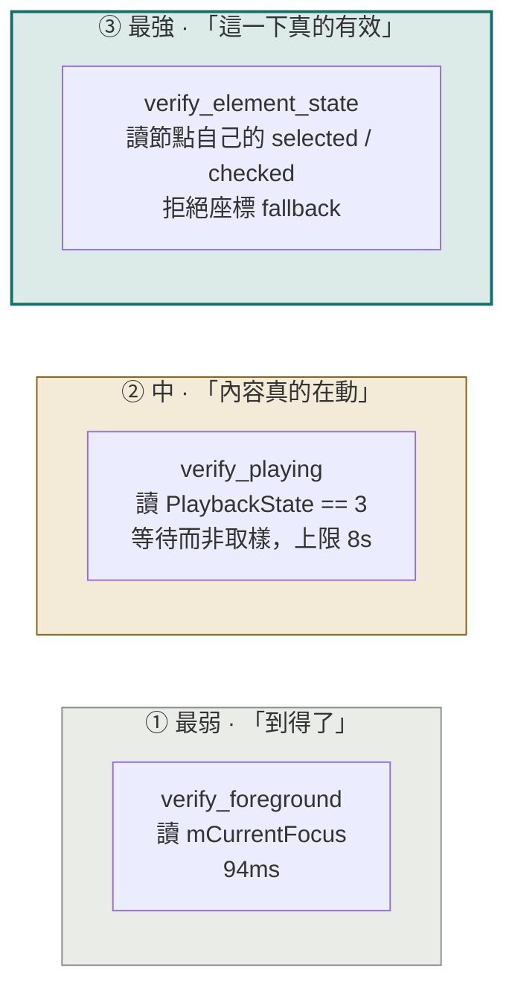
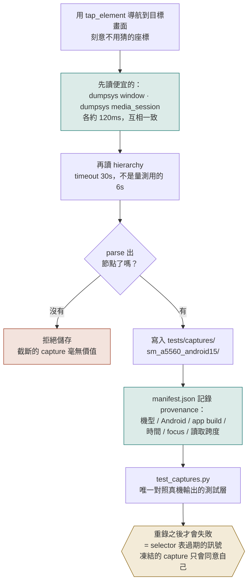

# AutoPerf 裝置測試架構與設計哲學

> 量測基準：Galaxy A55（SM-A5560）／Android 15／YouTube **21.30.209**
> 第二台：Redmi Pad 2（2603ARP14G）／Android 16／YouTube **20.38.37**／橫向平板 —— 見 **§十二**
> 測試規模：417 core + 149 webapp = 566
> CI：GitHub Actions，每次 push 在 Ubuntu 與 Windows 各跑一次全套 —— **runner 上沒有手機**（見 **§十一**）

---

## 一、為什麼需要這份文件

這套測試的失效模式**從來不是 flaky，而是「自信的綠燈」**。

以下是六個**由真機推翻**的缺陷。中欄是「當這個 bug 還活著的時候，測試套件說了什麼」；右欄是這份文件其餘章節存在的理由 —— **現在換誰站在那個位置**。

| 缺陷 | 當時的測試套件 | 現在誰會抓到它 |
|---|:--:|---|
| `dumpsys media_session` 的 regex 只認舊格式 → `is_playing` 在所有現代裝置上回 `None` → **系統裡最強的檢查靜默地什麼都沒驗證** | 🟢 綠燈 | **§九** 的 `CapturedAdb("watch_page_playing")` —— 一行，用真機文字 |
| 19 個 selector label 全是猜的，而且錯 | 🟢 綠燈 | **§九** 的真機擷取＋`preflight` 評分，而且**現在是關卡**：非預期地掉到座標會把 run 標成 unverified，10 個經兩台裝置驗證的 target 連座標都拿掉了（**§十二**） |
| 搜尋流程點了搜尋框就去點「建議」的位置，**從來沒有打字** → 七個 scenario 從未進到影片 | 🟢 綠燈 | **§八** 的 `verify_playing` —— 沒真的進到影片，`PlaybackState` 就不會是 3 |
| `screen_size` 沒考慮旋轉 → 所有比例座標都用直向尺寸計算 | 🟢 綠燈 | **§七** 每個動作重讀 `dumpsys window displays`。**這條修正是為假想的橫向平板寫的，2026-08-02 被第一台真的橫向平板證實**（**§十二**） |
| TV adapter 拿 scenario 的套件名比對實際啟動的 `.tv` 套件 → 每次 run 都 unverified | 🟢 綠燈 | **還沒有人。** TV 端刻意暫停，理由寫在 **§十一** |
| 手機鎖屏時 `mFocusedApp` 仍指著 YouTube → `verify_foreground` **與** `verify_playing` 同時通過，量到的卻是鎖定畫面 | 🟢 綠燈 | **§八** 的 `verify_foreground` 現在同時讀 `mDreamingLockscreen` —— 同一份 `dumpsys window`，零額外成本 |

**六個都是在真機上發現的，沒有一個是測試抓到的。** 而右欄現在是五筆結清、一筆掛帳 —— 掛著的那一筆比結清的五筆更值得看。

> 第六筆是 2026-08-02 這次真機驗證才發現的，而且發現的方式本身就是重點：**它不是被想出來的，是因為那天手機剛好鎖著**。`uiauto.current_focus` 的正則同時接受 `mCurrentFocus` 與 `mFocusedApp`，docstring 寫著「Either is enough」；鎖屏時前者是 `NotificationShade`（不含 `套件/活動` 形狀，正則掃過去不匹配），後者仍是 YouTube，於是回報「在前景」。**那個「Either is enough」的假設，就是這一筆帳的全部內容。**
>
> 它在被發現的當天就結清了，因為修它幾乎不花錢：`verify_foreground` 本來就在讀 `dumpsys window`，`mDreamingLockscreen` 就在同一份輸出裡。**貴的從來不是修，是知道它存在** —— 而知道它存在，花的是一台剛好鎖著的手機。

> 一套無法為「系統真正會壞的原因」而失敗的測試，不是安全網，只是第二個要維護的東西。

---

## 二、分層架構

整個裝置層只有**一個出口**：`adb.shell(serial, command, timeout)`。這是這個 codebase 最好的一個決定 —— 417 個測試能在沒有裝置的情況下跑完，全靠它。

CI 是這個決定的直接回報：GitHub Actions 每次 push 在 Ubuntu 與 Windows 各跑一次完整的 566 個測試，**runner 上沒有 adb、沒有模擬器、沒有手機**。跑兩個平台是因為這個專案在兩個地方講了平台專屬的話 —— Celery 的 `--pool=solo`（為 Windows 選的）與 `DeviceSupervisor` 的 `spawn`。



**關鍵設計：決策層從不自己建立 client。** `uiauto.py` 裡有兩種函式 —— `parse_hierarchy` / `find` / `resolve` 是純的，把文字變成決定；`dump_hierarchy` / `is_playing` / `current_focus` 會發指令，但它們的第一個參數永遠是傳進來的 `AdbClientProtocol`，模組自己從不去拿一個。

這條線就是整份文件的支點：因為 adb 是注入的，所以你能把一份真機擷取的文字直接塞進 `is_playing`（**§九** 那一行測試）；也因為如此，selector 邏輯不需要裝置就能測（Humble Object 模式）。

---

## 三、測試替身掛在哪一層

測試作者**只需要決定「我測哪一層」**，替身就跟著定下來 —— 不靠記憶。



三個替身，職責刻意分開：

| 替身 | 職責 | 為什麼不能合併 |
|---|---|---|
| `RecordingAdb` | 斷言**送出了什麼**（Spy） | 與下者職責相反；合併會讓每個測試都要設定兩半 |
| `DeviceAdb` | 供給**裝置回什麼**（Stub） | 同時記 `dumps` 計數，因為成本是假物件唯一藏得住的東西 |
| `CapturedAdb` | 重播**真機擷取的文字** | 那份文字沒人寫過 —— 這句話的完整意思要到 **§九** 才成立，那裡也是它唯一的資料來源 |

**嚴格是預設。** 未列出的指令會 raise。曾經有兩個同名 `FakeAdb`：一個 `KeyError`、一個靜默回 `""` —— 所以打錯的指令會不會讓測試失敗，取決於你在哪個檔案。現在寬鬆是一個顯式參數 `allow_unknown=True`。

---

## 四、測試分組：按「什麼情況下會壞」

上一節決定了替身掛在哪；這一節決定**整套測試怎麼被找到**。兩者是同一個問題的兩半，所以放在一起。

按模組分只是把 src 目錄抄一遍。按失敗原因分，才回答得出維護者真正會問的問題。


| 群組 | 什麼時候會壞 | 測試數 |
|---|---|--:|
| `logic` | 我們自己的邏輯改了。**這裡不知道「裝置」是什麼** | 131 |
| `parsing` | 裝置吐的東西跟 fixture 假設的不一樣 ← 擷取的畫面都在這 | 70 |
| `commands` | 送出去的指令形狀改了 | 44 |
| `elements` | selector 解析或 `verify_*` 動作改了 | 44 |
| `flow` | 整條流程對假裝置跑不通 | 128 |
| `webapp` | API / Celery / 串流 | 149 |

只有 `parsing` 與 `elements` 會被 YouTube 改版打到。**整個套件近三分之一（`logic`）跟任何裝置都無關** —— 出事時值得先知道這件事。

```powershell
python scripts/run-tests.py            # 全部，一個指令（含 webapp）
python scripts/run-tests.py --list     # 有哪些組、各自何時會壞
python scripts/run-tests.py parsing    # 只跑會過期的那一片
```

**地圖不會爛掉**：測試模組不在任何組 → 「跑全部」會靜默跳過它 → `test_suite_groups.py` 失敗。在兩組 → 跑兩次卻讀成兩種風險 → 也失敗。

> 全部 566 條的逐條清單 —— 每一條的**測試目的**與**測試方法**（用了哪個替身、有沒有 patch、打不打 HTTP）—— 在 HTML 版的「**測試項目**」分頁，而且**先分成「裝置測項」與「非裝置測項」兩塊**：實際判定下來是 **378 / 188**。判定的問題是「沒有裝置這個概念，這個測試還有沒有意義」，依據是測試本體真的碰到什麼（adb 替身、adapter、畫面結構、selector），每一列都附上那個依據，所以這個分類可以被反駁。
>
> 那份清單是每次建置時從測試本身讀出來的（`scripts/collect-tests.py`），不是手寫的：手寫的清單會過期，而過期又看起來完整的清單，正是這一整套東西在防的謊。

> 這個「按失敗原因分類」的原則不只用在測試套件上。同樣的分法也是 scenario 分層（smoke / functional / regression）該有的樣子 —— 見 `docs/TEST_PLAN_zh-TW.md`。

---

## 五、一次量測 run 的流程

前四節都是靜態結構。從這裡開始是動態的：一次 run 實際發生什麼。



上圖裡 `A->>U: dump_hierarchy → parse → resolve` 那一格，展開後就是 **§七**。但要先知道那一格值多少錢。

---

## 六、實測：一切決策的前提

接下來三節（預算、驗證、擷取）的每一個設計都是從這張表推出來的，所以它放在它們前面。

### 每個 primitive 的成本

兩欄都是同一台 A55 的五次中位數，隔了三天、跨了一次 app 更新（21.29.366 → 21.30.209）。**並列而不是覆蓋，因為「數字會漂」本身就是結論**：任何拿單次量測當常數的設計，都要先問它漂多少。

| 讀取 | 07-30 | 08-02 | 差 | 大小（08-02） | 備註 |
|---|--:|--:|--:|--:|---|
| `wm size` | 147ms | 131ms | −11% | 25 B | 已快取：一次 run 內不會變 |
| `dumpsys window displays` | 122ms | 107ms | −12% | 25.8 KB | 旋轉，每次動作重讀 |
| `dumpsys window` | 141ms | 113ms | −20% | 68.6 KB | `verify_foreground` |
| `dumpsys media_session` | 121ms | 107ms | −11% | 19.7 KB | `verify_playing` |
| `dumpsys cpuinfo` | 118ms | 101ms | −14% | **12.9 KB** | 大小比 07-30 記的 8.8 KB 多了 47% |
| `cat /proc/meminfo` | 105ms | 94ms | −11% | 1.5 KB | |
| `dumpsys battery` | 113ms | 101ms | −11% | 11.4 KB | |
| **`uiautomator dump` + `cat`** | **2611ms** | **2.6–2.8s** | ~0% | 33 KB | **見下** |

**便宜的讀取整體漂了 11–20%，而且方向一致（全部變快）** —— 一致的方向表示這是環境差異（裝置溫度、背景負載、adb 通道），不是量測誤差。對設計沒有影響：它們彼此仍在同一個數量級，而所有決策依賴的是 dump 與它們之間的**倍數**，不是絕對值。

`uiautomator dump` 隨畫面狀態變動，08-02 重測把這件事量得更細：

| 畫面狀態 | 中位數 | 說明 |
|---|--:|---|
| 觀看頁 · 播放中 · 控制列隱藏 | **2.6–2.8s** | 穩態，08-02 重測 4 次都落在此 |
| 觀看頁 · 剛點過畫面（轉場中） | **4.9s** | 點擊叫出控制列後立刻 dump，成本翻倍 |
| 觀看頁 · 未 idle 的極端狀態 | **11.4–12.5s** | 08-02 實際遇到 4 次；07-30 記為「11.7s 最差」 |
| 停止播放 / 首頁 | 2.5–3.6s | |

**修正 07-30 的一個說法**：當時記的是「3.0s 播放中 / 11.7s 最差」，把 11.7s 當成罕見的極端值。08-02 實測顯示，**11.7s 不是罕見，是畫面持續不 idle 時的常態** —— 而且生產的 `dump_timeout` 是 6.0s，所以那個狀態下 dump 會直接逾時、掉座標。真正決定成本的不是「有沒有在播」，是**畫面有沒有停下來**。

還有一個數字要更新：`dump` 對其他讀取的倍數。用 08-02 的數字，穩態是 **26 倍**（2.7s / 105ms），而不 idle 時是 **110 倍**。原文寫的「20 倍」是保守值。

### 三種看起來更便宜的 dump，實測後全部否決

| 做法 | 中位數 | 結論 |
|---|--:|---|
| `dump --compressed` | 2455ms | 快 6%，但 **72 節點變 27** —— 剪掉了 selector 需要的 view |
| `shell … /dev/tty` | 2331ms | 根本沒回 XML，只有一行狀態訊息 |
| `exec-out … /dev/tty` | 2546ms | 結束標籤後接了狀態訊息，**解析失敗** |

彼此都在 12% 內 —— 成本是「等 UI idle」而不是傳輸。**唯一有意義的優化是少 dump。**

### 啟動：deep link 兩項都贏

| | 指令返回 | app 真的到前景 |
|---|--:|--:|
| `monkey -c LAUNCHER` | 506ms | 0.95s |
| `am start -a VIEW -d <watch url>` | **115ms** | **0.57s** |

又快又確定 —— 這就是 `play_*` preset 才是 baseline 比較正確工具的原因（而且它們花 **0** 次 dump）。

---

## 七、`tap_element` 的決策與預算

這張圖是**真機量測後才長成現在這樣**的 —— 上一節那張表就是它的輸入。


圖上方那個「每次都重讀 `dumpsys window displays`」，就是 **§一** 第四筆帳的結清處：`screen_size` 只讀一次而忽略旋轉時，所有比例座標都在用錯的尺寸算。122ms 買的是這個。

### 為什麼是「時間預算」而不是「重試次數」

| | 修改前 | 修改後 |
|---|---|---|
| 停止條件 | `resolve_attempts = 3` | `resolve_budget = 7.0s`（次數降為上限） |
| 觀看頁最差耗時 | **25.5s**（3 次 dump，23.4s 在 dump） | **6.25s** |
| 對上 `adapter_action_timeout = 10.0s` | ❌ 步驟被殺掉 | ✅ 落在預算內 |

用 **§六** 的中位數算：`3 × 3.0s + 2 × 1.0s = 11.0s > 10.0s`。也就是說，**那個「為了救『步驟比 app 畫完更早到』而存在的重試」，實際上是讓整個步驟被殺掉 —— 比不重試更糟。** 而原本沒有任何東西把這兩個數字連起來，這就是它們能互相矛盾的原因。現在有一個測試斷言 `resolve_budget < adapter_action_timeout`。

「還能不能再試一次」用**上一次 dump 自己的耗時**當估計，所以它會自我校準：dump 快的裝置跑滿三次，慢的裝置跑一次然後誠實掉座標。

---

## 八、三種驗證強度

這**不是三個階段**，是三種強度 —— 每個 scenario 挑它付得起的最強的那一個。三者互不依賴，也不依序執行。



| 檢查 | 能證明什麼 | 抓不到什麼 |
|---|---|---|
| `verify_foreground` | app 真的到前景（`am start` 只保證 intent 送出，不保證可用） | 首頁 feed 也會通過；**手機鎖屏也會通過**（見下） |
| `verify_playing` | 影片**真的在播** —— 唯一能區分「search_and_play 成功」與「四次點擊打在空白處」 | 讚有沒有按下；**螢幕是不是亮的**（見下） |
| `verify_element_state` | 控制項自己的狀態 —— 唯一能證明「讚真的按下」而非「按鈕被找到並點了」 | 見 **§十一** 的限制 |

中間那一格就是 **§一** 第三筆帳的結清處。搜尋流程從沒打字、七個 scenario 從沒進到影片時，`verify_foreground` 全數通過（YouTube 確實在前景，只是停在首頁）；只有 `PlaybackState == 3` 會說不。

三者都是**三態**（`True` / `False` / `None`）。讀不到回 `None`，不當失敗。

### 三種強度共同的盲點：鎖屏（**§一** 第六筆）

2026-08-02 實測，手機鎖著、YouTube 在背景放音訊時：

```
verify_foreground -> {'verified': True}   # mFocusedApp 仍是 YouTube
verify_playing    -> {'verified': True}   # 音訊真的在播，PlaybackState == 3
```

**兩個都通過，而螢幕上是鎖定畫面。** 所有 `play_*` 測項只用這兩個檢查，所以那樣的 run 會標成 completed + verified，而量到的 CPU／記憶體是「鎖屏 + 背景音訊」，不是「觀看頁在算圖」—— 兩者差很多。

這不是「強度不夠」的問題，加第三種也擋不住：`verify_element_state` 在鎖屏時根本 dump 不到觀看頁的節點，只會回 `None`，而 `None` 不當失敗。**三種強度全部答不出「螢幕是不是亮的」，因為沒有一個去問。**

漏掉的那一問很便宜 —— `dumpsys window` 的輸出裡就有 `mDreamingLockscreen`，而 `verify_foreground` 已經在讀這份輸出了，等於免費。**現在做了**：`uiauto.window_state` 一次讀取同時回傳焦點與鎖屏狀態，鎖著就丟 `VerificationError`。

鎖屏狀態是**三態**，跟其他檢查同一條規則：明確為 `true` 才失敗，讀不到（有些 build 不印那一行）不當失敗。而它值得做的理由不是理論上的完整性 —— 是它在被發現的當天就毀掉了一次平板量測（**§十二**）。

---

## 九、Capture 流程：讓 fixture 從猜測變成證據



### 第三課（2026-08-02 補）：**capture 不會自己過期，是人去重錄才過期**

上圖最後那一格原本寫的是「YouTube 改版時本來就該失敗」。08-02 真機驗證推翻了這個說法的一半：

YouTube 從 21.29.366 更新到 21.30.209 之後，`preflight` 對真機立刻回報 `ok: false`、8 個 target 需注意；而**整個測試套件仍然全綠**。原因很直白 —— capture 是硬碟上的檔案，app 更新不會改動它，所以測試只是繼續拿舊畫面對舊 selector，兩邊一致，永遠通過。

**偵測漂移的是 `preflight`（對真機），不是測試套件。** 測試套件的角色在重錄之後才開始：把 8 個畫面重錄到 21.30.209，同一組測試立刻紅了兩個 ——

| 測試原本斷言 | 重錄後實測 | 意義 |
|---|---|---|
| `player_surface` 掉座標 | **`resource_id`** | 播放器容器在新版有 id 了 |
| 觀看頁 `like_button` 掉座標 | **`content_desc`** | 讚按鈕在新版進了 accessibility tree |

兩個都是**往好的方向**被推翻：新版 app 暴露的東西變多，而舊測試把「當時做不到」寫成了「本來就不該做到」。

> 所以這一層真正的契約是：**capture 是證據，不是警報器。** 它只保證「當你去問的時候，答案來自真機而不是想像」。要它變成警報器，缺的那一步是「定期重錄」—— 而那一步至今仍然要有人記得做，跟 **§十一** 的 `preflight` 是同一種掛帳。

### 做這件事的過程本身教了兩課

**1. 錄錯畫面比沒錄更糟，因為它看起來像證據。**
第一次錄 `shorts` 時我用猜的座標點分頁、沒點中，結果把 **launcher** 存成了 `shorts`。manifest 記的 `focus` 欄位抓到了。重錄改用 `tap_element` —— 所以 selector 表必須有效，這個 capture 才會存在。

**2. capture 不是快照，是一段時間窗。**
hierarchy dump 要 2.6–11.7 秒，dumpsys 只要 120ms（**§六**）。原本先 dump 的順序，讓觀看頁的 capture 存下了「播放中的 hierarchy」配「`STOPPED` 的 media_session」—— 因為我用的 golden video 只有 19 秒，在 dump 期間播完了。現在便宜的讀取先做，跨度也記進 manifest。

### 最有價值的一行測試

```python
self.assertIs(uiauto.is_playing(CapturedAdb("watch_page_playing"), "S1", YOUTUBE), True)
```

這正是 **§一** 第一筆帳 —— 那個讓「系統裡最強的檢查」靜默什麼都不驗證的 bug。**猜出來的資料永遠抓不到，真機文字一測就現形。**

（08-02 重錄到 21.30.209 之後這一行仍然成立：新擷取的 `media_session` 記的是 `state=PLAYING(3)`，擷取前也先確認過 `is_playing` 為 `True`。）

這一行之所以寫得出來，是因為 `is_playing` 的第一個參數是注入的 adb（**§二**）。整份文件的兩端在這裡接上：架構上的那個選擇，換來的就是這一行。

---

## 十、七條原則，每一條都用一個 bug 換來

前九節講的是結構與證據；這一節是把它們壓縮成可以帶走的東西。這七條的來源比 **§一** 那五筆更廣 —— 其中三條（4、5、6）換來的 bug 沒有出現在那張表上，因為它們傷的是**測試套件自己**，不是量測結果。列在這裡才有地方放。

| # | 原則 | 換來的代價 |
|:--:|---|---|
| 1 | **「不知道」不等於「失敗」** | 反面才致命：永不失敗的 `None` 等於沒驗證。所以第三態必須稀少、大聲、可區分 —— 要被記錄，不能被吞掉 |
| 2 | **靜默的成功比大聲的失敗更糟** | `input tap` 對空白處也回成功 → 錯失的點擊被記成「動作完成」，run 綠燈收場卻量了一個沒被碰過的畫面 |
| 3 | **等狀態，不要取樣** | 固定時間點的檢查，在快網路通過、慢網路失敗。真機上：直播還在緩衝就被判 not-playing |
| 4 | **用結構取代紀律** | 六個等待旋鈕只有兩個可注入，漏掉兩個的還是「坐在做對的類別旁邊」的測試。代價：87 秒裡的 61 秒 |
| 5 | **用空集合取代清單** | 清單會過期。改成斷言「沒有別的地方可以放等待」 |
| 6 | **斷言成本，因為假物件把它藏起來了** | dump 2.60s / 最差 11.66s，其他讀取 0.12s（**§六**）。一個效能工具用 12 次 dump 污染自己量的 CPU |
| 6b | **成本要在失敗的路徑上也記得下來** | 原本 `tap_element` 只在回傳值裡帶 `dumps`，所以拋例外就跳過了 —— 而**找不到元素通常是最貴的一次**，重試迴圈要把預算花完才放棄。結果是反的：污染自己量測最嚴重的那一步，看起來成本掛零。實測一次 6.081 秒的 dump 就是這樣消失的 |
| 7 | **沒人擷取的 fixture 就是猜測** | 36 個手寫 fixture 與程式碼「天生一致」，所以永遠不可能反駁它 |

---

## 十一、已知限制，以及下一章

**§一** 的方法論只有一句話：**真機推翻了五個綠燈。** 那麼這一節就是它的直接推論 —— 下面每一條，都是「目前還沒有東西能推翻它」。

- **只有一台裝置。** capture 全部來自 A55／Android 15。換第二支手機一定會有幾條被推翻，而那個矛盾是目前沒人擁有的資訊。**這是清單上最重要的一條** —— 見下方「下一章」。
  > **一個 app build 這半條已經先被推翻了**（2026-08-02）。同一台 A55 上 YouTube 從 21.29.366 更新到 21.30.209，就足以讓兩條原本寫著「永久」「測不了」的限制作廢（見下面兩條）。**換裝置會推翻什麼還不知道，但換版本推翻了什麼，現在知道了 —— 而且花的時間是三天，不是換一台硬體。**
- **CI 上跑的，是那 566 個不需要真機的。** 每次 push 都會在 Ubuntu 與 Windows 各跑一次全套（**§二**）—— 但 **runner 上沒有手機**，所以 CI 能證明的僅止於「我們自己的邏輯沒被改壞」。缺的是硬體，不是程式碼。`preflight` 是正確的想法 —— 一個真的走一遍並評分 selector 表的流程。它現在可以從 dashboard 按一顆按鈕觸發，也可以只檢查某一個 scenario 用到的元素（scoped preflight：`search_and_play` 是 3 個，不是整個涵蓋組的 21 個），而且跟量測 run 搶同一把裝置鎖 —— 因為它自己也在點、也在 dump，跟 run 重疊就是把工具的成本混進被量測的數字裡。

**但它仍然不是一道關卡。** 一顆按鈕跟一個指令的差別只是成本，不是性質：兩者都要有人記得去按。真正的關卡是「這次 scenario 需要的 target 掉了座標 → run 直接被擋下或當場標成 unverified」，而那還沒有做。**§一** 第二筆帳因此仍只結清了一半。
- **讚按鈕的狀態測不了 —— 但「找不到」那半條已經作廢。**
  仍然成立的是狀態：`selected` 與 `checked` 點擊前後都不動，唯一變化的是**全站讚數**（兩次讀取間隔幾秒就變了 13），所以 `verify_element_state` 沒有東西可以指。**這是結論，不是缺口。**
  已經作廢的是可定位性：21.29.366 上讚按鈕根本不在觀看頁的 hierarchy 裡，測試把這件事寫成了斷言；21.30.209 上它以 `content_desc` 命中（`和另外 11,285 人都喜歡這部影片`，靠子字串比對）。**「找不到」與「狀態不會動」被當成同一條限制寫在一起，實際上是兩條，而只有後者還活著。**
- **播放器自繪的控制項只能靠座標 —— 範圍要收窄。**
  仍然不在 accessibility tree 裡的是 **5 個**：`fullscreen_enter`／`fullscreen_exit`／`quality_row`／`quality_option`／`pip_caret`。
  已經進去的是 `player_surface`（21.30.209 起有 `resource_id`）與 `overflow_menu`（以 `content_desc` 命中）。原文寫「全螢幕、畫質、進度條完全不在」時，把**播放器畫進去的容器**和**播放器畫出來的控制項**算成同一件事 —— 容器現在定址得到，控制項仍然定址不到。
- **`tablet` 是一個沒有被命名的裝置類別。** `select_profile` 只認 `phone` 與 TV，Redmi Pad 2 靜默落進 `PhoneProfile`（**§十二**）。結果大致可用，但「這台裝置不在已知分類裡」這件事沒有被記錄在任何地方。
- **11 個測項的量測對象不可重現。** 24 個測項裡有 11 個用「輸入關鍵字 → 點第一個結果」導航（`like_video`、`comment_scroll`、`fullscreen_toggle_cycle`、`quality_switch_manual`、`seek_*`、`pip_minimize`、`multi_video_session`、`app_switch_cycle`、`background_foreground_resume`、`search_and_play`）。落在哪支影片由當天的搜尋排序決定 —— 08-02 落在一支 **11 小時 59 分的直播**。
  兩個後果：量測上，那 11 個測項跟 baseline 比的是**不同的內容**，負載本來就不一樣；工具上，`preflight` 走的是同一條路，所以它在那支直播的觀看頁上把 `like_button` 與 `comments_row` 報成需注意 —— **那是誤報，同一個 selector 在 deep-link 進去的觀看頁上正常命中**。
  **§一** 第三筆帳修好的是「有沒有真的進到影片」（`verify_playing` 會說話），不是「進到哪一支」。只有 4 個 `play_*` 用 deep link 指定固定影片，量的才是同一個東西。改不改是設計問題：那 11 個測項要量的若是「使用者搜尋然後看片」的真實流程，非決定性就是流程的一部分；若要拿來跟 baseline 比較，就得換成 deep link。**目前兩件事混在一起，而文件到這一版才把它寫出來。**
- **鎖屏會讓兩種驗證同時通過**（**§一** 第六筆、**§八** 末段）。`verify_foreground` 與 `verify_playing` 都不問螢幕亮不亮，所以鎖屏狀態下的 run 會標成 verified，量到的卻是鎖定畫面加背景音訊。目前唯一的防線是 `DEMO_SCRIPT` 準備清單裡的「螢幕逾時設 10 分鐘或永不」—— **那是紀律，不是結構**，而這份文件的其餘部分都在講為什麼那不夠。
- **TV 端刻意暫停。** `AndroidTvAdapter.tap_element` 仍自己重寫 resolve 迴圈，所以 **§七** 的預算修正到不了 TV；scenario 庫也還硬引用手機的 `selectors`。兩者都寫在 `profiles.py` 的 docstring 裡。這就是 **§一** 第五筆帳至今掛著的原因。

### 下一章已經發生了

上面第一條寫著「沒有人知道換一台裝置會推翻哪幾條」。2026-08-02 接上了第二台，答案在 **§十二**。

---

## 十二、第二台裝置：Redmi Pad 2

| | Galaxy A55 | Redmi Pad 2 |
|---|---|---|
| `ro.build.characteristics` | `phone` | **`tablet`** |
| Android | 15（SDK 35） | **16（SDK 36）** |
| 面板 | 1080×2340 直向 | 1280×2048，**實測時橫向**（座標空間 2048×1280） |
| density | 450 | 280 |
| YouTube | 21.30.209 | **20.38.37**（舊一個大版本） |

兩台裝置、兩個 Android 版本、兩個 app 版本、兩種形狀因子。**這是這份文件第一次有東西可以拿來反駁自己。**

### 被推翻的

**一、成本表只對一台裝置成立。** 同樣的五次中位數：

| 讀取 | A55 | Pad | 差 |
|---|--:|--:|--:|
| `dumpsys window` | 113ms | **240ms** | **+112%** |
| `dumpsys media_session` | 107ms | 166ms | +55% |
| `dumpsys window displays` | 107ms | 162ms | +51% |
| `dumpsys battery` | 101ms | 150ms | +49% |
| `dumpsys cpuinfo` | 101ms | 109ms | +8%（但輸出 **61 KB** 對 12.9 KB） |

`dumpsys window` 是 `verify_foreground` 每次都讀的那一個，在平板上是兩倍多。**§六** 那張表現在要讀成「A55 上的成本」，不是「成本」。

**二、`tablet` 這個分類不存在。** `select_profile` 只認 `phone` 與 TV，平板靜默落進 `PhoneProfile`。結果大致正確（觸控、同一個套件、三個 collector 都能用），但**沒有任何地方記錄「這台裝置不在已知分類裡」** —— 與 **§五** 那句「分開拿是『TV 被正確驅動卻用手機的假設量測』的來源」是同一種風險。

### 沒被推翻的（同樣重要）

- **旋轉修正成立。** `screen_size` 的 docstring 寫著「a landscape tablet would therefore have every fractional coordinate computed against portrait dimensions」—— 那段是為假想的裝置寫的。第一台真的橫向平板上，它回傳 (2048, 1280)，與截圖完全一致。**為想像中的情況寫的防線，被真實情況證實。**
- **三個 collector 全部可攜。** 平板上 `battery.level=62`、`temperature=33.0`，即使它的 `dumpsys battery` 輸出只有 0.8 KB（A55 是 11.4 KB）。抽象工廠這一層通過了。
- **selector 表大致撐住了。** 10 個 target 在兩台裝置、兩個 app 版本上都以同一種策略命中 —— 其中 6 個靠 content-desc、3 個靠結構、1 個靠 resource-id。

### 這一天最貴的一課：一份被污染的量測，看起來跟真的一樣

第一次跑平板 preflight，報告說 **21 個 target 有 15 個壞掉**，看起來像「selector 表在平板上崩潰」。我照著這個結論寫了分析，甚至推導出「content_desc 跨裝置只有 17% 存活率」這種具體數字。

**全部是假的。** 平板的螢幕逾時是 60 秒，preflight 跑了好幾分鐘 —— 中途鎖屏之後，每一個 target 都是拿去跟 SystemUI 的 **18 個鎖屏節點**比對的。喚醒之後同一個畫面有 **181 個節點**，那些 selector 全部正常命中。

三件事值得記下來：

1. **第六筆帳（鎖屏）不是理論上的風險。** 它在被發現的同一天，就毀掉了一整次真機量測，並且產出了一個看起來有數據支撐的錯誤結論。
2. **錯誤的方向是「過度回報」而不是「漏報」。** preflight 沒有把壞的說成好的，它把好的說成壞的 —— 而一個會誤報的把關者，比沒有把關者更糟，因為它會叫人去修沒壞的東西，然後下一次真的壞掉時沒有人相信它。
3. **這正是這份文件從 §一 就在講的事，只是這次輪到工具自己。** 「一套無法為真正的原因而失敗的測試，只是第二個要維護的東西」—— 一份會為錯誤的原因而失敗的報告也是。

### 因此：preflight 的四道防線

| 防線 | 擋掉的假警報 |
|---|---|
| 鎖屏偵測 | 對著 18 個 SystemUI 節點評分 |
| 連鎖抑制（`UNRELIABLE`） | 一次盲點擊之後，畫面已經不是 scenario 描述的畫面，後續一律不評分 |
| 穩定判定（`_settled_nodes`） | 連續 dump 直到節點數不變。平板首頁啟動 8 秒時 85 節點、穩定後 176 節點，`search_icon` 在前者失敗、後者命中 |
| `BY_DESIGN` | `coordinate_only` 的 5 個控制項不再算成 finding —— **一個沒人能處理的 finding 比沒有 finding 更糟，它會教人跳過整張清單** |

報告因此多了兩個桶：`ungraded`（沒評到）與 `by_design`（設計如此）。**未評分既不算 finding 也不算通過** —— 一份幾乎沒評到東西的報告，不能長得像一份乾淨的報告。

效果：A55 的 findings 從 **8 降到 5**，消失的三個都附上了理由（`fullscreen_exit not graded: fullscreen_enter was tapped blind`）。

### 以及：座標從「預設」變成「掙來的」

原本 21 個 target 全部都有座標 fallback，理由寫在 `Target` 的 docstring 裡：selector 是未經證實的猜測，猜錯不該弄壞一個本來能跑的 scenario。

那個理由對 10 個 target 不再成立 —— 它們在兩台裝置、兩個 app 版本上都由 selector 命中。對這些，座標不再是保險，而是**讓一個腐化的 selector 繼續點在看似合理的地方並回報成功**的那個東西。所以拿掉了。

現在 21 個裡有 11 個保有座標，其中 5 個是 `coordinate_only`（app 自繪，沒有別的路可走）。契約也跟著改寫：從「每個 target 都要有座標」變成「**每個 target 都要能被某種方式抵達**」。

實機對照，同一個 scenario 在平板上：

| | selector_fallbacks | verified | 事件 |
|---|--:|---|---|
| 改動前 | 2 | **true** | 兩次盲點擊，靜默通過 |
| 加了 `selector_stale` 之後 | 2 | false | 誠實標記，但仍盲點擊 |
| 拿掉座標之後 | **0** | false | `no element matched library_tab and no coordinate fallback was given` |

最後那一行就是這一整節的重點：**它指名了哪個 target、在哪台裝置上、為什麼失敗** —— 一個開發者可以直接拿去修的句子，而不是一個綠燈。

---

## 一句話總結

> **在某個測試套件之外的東西 —— 一台裝置、一次量測、一份擷取 —— 有機會反駁它之前，先假設它在說謊。**
>
> 所以要做的事永遠只有一件：**再找一個能反駁它的東西。**
