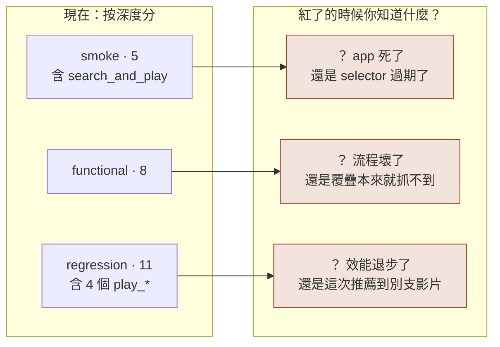
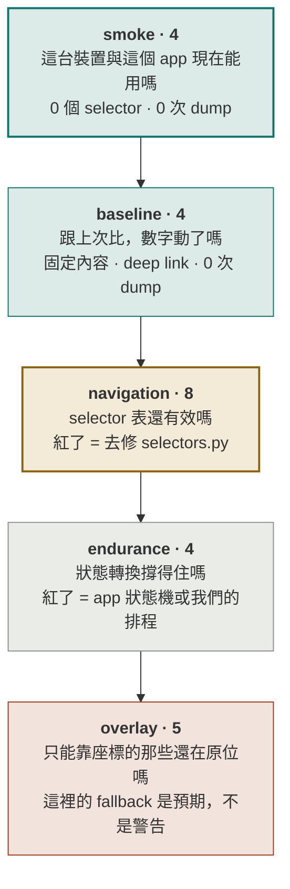
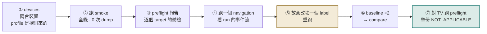

# AutoPerf 測試計畫（scenario 分層重擬）

> 這份文件重擬的是 **scenario 的分層（tier）**，不是測試套件的分組。
> 測試套件的分組見 `DEVICE_TESTING_zh-TW.md` §四；這份文件把同一個原則往下推一層。

---

## 一、一句話的原則

`DEVICE_TESTING_zh-TW.md` §四 對**測試套件**用了一個原則：

> 按模組分只是把 src 目錄抄一遍。**按失敗原因分**，才回答得出維護者真正會問的問題。

那個原則沒有被推到 **scenario** 這一層。現在的 tier 是按「深度／耗時」分的 —— smoke 淺、functional 中、regression 深。這回答的是「這一批要跑多久」，不是「它紅了代表什麼」。

**重擬後的規則只有一條：一個 tier 只回答一個問題，而且它失敗時只有一種解讀。**

---

## 二、現況盤點與五個問題

24 個 preset，目前分佈：smoke 5／functional 8／regression 11。

**問題一：smoke 裡放了全套件最脆弱的流程。**
`search_and_play` 有 7 個 step、3 個 `tap_element`、一次打字、一個 `verify_playing`，還依賴網路與搜尋結果。它紅掉時，你分不出是 app 掛了還是 selector 過期了 —— 而 smoke 存在的唯一理由就是給你一個沒有歧義的答案。順帶一提，`DEVICE_TESTING` §一 的第三筆帳正是這條流程。

**問題二：最乾淨的量測被埋在最慢的層。**
四個 `play_*` 是唯一固定內容、deep link、**0 次 dump** 的 preset，文件 §六 明說它們才是 baseline 比較的正確工具。但它們在 `regression` 裡，而要跑 `regression` 就得連另外 7 個重流程一起跑。**「我只想做一次乾淨的效能比較」目前沒有任何一個 tier 給得出來。**

**問題三：tier 同時是「節奏」也是「一次跑完的集合」。**
`youtube.py` 的註解說 tier 是 cadence（常跑／每天／每晚），但 `trigger_suite(tier)` 與 `campaign(tier=...)` 把它當成「一次全跑」的集合。兩個意思黏在同一個欄位上，就沒辦法說「每晚跑效能比較，但不要跑 pip 和 seek」。

**問題四：已知永遠掉座標的 preset 混在正常流程裡。**
文件 §十一：全螢幕、畫質、進度條**不在 accessibility tree 裡**，永遠靠座標。它們現在散在 functional 與 regression，於是每次掃描都會產生一批**預期中的** `selector_fallback` 事件 —— 而 `selector_fallback` 的全部意義是「selector 開始腐化的早期警告」。把預期的噪音混進警告裡，警告就失效了。

**問題五：`regression` 這個字在這個 codebase 裡已經有另一個意思。**
`analyzer.compare()`、`DEFAULT_REGRESSION_THRESHOLD_PCT`、trend fitting 全部用 regression 指**效能回歸**。tier 又拿它指「深度測試」。同一個字兩個意思，而且兩個都常出現在同一份報告上。

---

## 三、重擬後的五層

箭頭是**建議的執行順序**，不是相依關係 —— 每一層都可以單獨跑。順序的意義是：前一層紅了，後一層的紅就沒有解讀價值。

### `smoke` · 4 個 · 「能用嗎」

| preset | 為什麼在這裡 |
|---|---|
| `device_settings_scroll` | 唯一跨平台（TV 也能跑）。證明的是 adb 通路能驅動 UI，跟 YouTube 無關 |
| `cold_start` | 最基本的存活檢查 |
| `cold_start_and_stop` | 啟動與強制關閉都正常 |
| `play_golden` | deep link 進到一支固定影片並 `verify_playing`。**一個 selector 都沒用到** |

**這一層不可能因為 YouTube 改版而失敗**，因為它一個 selector 都不碰。這就是它值得無腦跑的原因，也是它必須把 `search_and_play` 踢出去的原因。

`play_golden` 同時出現在這裡與 `baseline` 是刻意的：它既是存活檢查，也是比較基準。

### `baseline` · 4 個 · 「數字動了嗎」（新增）

`play_golden`／`play_baby_groot_dancing`／`play_suis_moi`／`play_rickroll`

四個都是 deep link 到釘死的影片 ID。文件 §六 的量測：`am start -a VIEW` 115ms 返回、0.57s 到前景，對比 `monkey` 的 506ms／0.95s；而且整條流程 **0 次 dump**。

0 次 dump 是這一層存在的技術理由：`uiautomator dump` 要 2.6–11.7 秒而且吃 CPU，跟 collector 取樣的是同一顆。**一個會 dump 的 scenario，量到的 CPU 有一部分是工具自己的。** baseline 對 candidate 的 delta 必須乾淨。

固定影片是它存在的方法論理由：內容一樣，長度一樣，解析度一樣。delta 才會是 app 的變化。

### `navigation` · 8 個 · 「selector 還有效嗎」

`search_and_play`（自 smoke 移入）／`home_feed_scroll`／`home_feed_tap_video`／`shorts_browsing`／`shorts_like_and_next`／`subscriptions_feed_browse`／`library_and_downloads_browse`／`comment_scroll`

所有真正依賴 selector 找元素的流程。**這一層紅了只有一種解讀：YouTube 改版了，去修 `scenarios/selectors.py`。**

正確的前置動作是 `preflight` 而不是直接跑 —— preflight 走一遍就給你逐個 target 的 MATCHED／FALLBACK，還附上當下畫面上有什麼；直接跑要等一整輪量測結束才在事件裡看到。

### `endurance` · 4 個 · 「撐得住嗎」

`background_foreground_resume`／`app_switch_cycle`／`multi_video_session`／`pip_minimize`

長流程、狀態轉換、多工。紅了代表 app 的狀態機或我們的排程有問題，跟 selector 的關係最小。

### `overlay` · 5 個 · 「座標還在原位嗎」（新增）

`fullscreen_toggle_cycle`／`quality_switch_manual`／`seek_scrub_forward`／`seek_long_press_skip`／`like_video`

前四個對的是播放器覆疊 —— 文件 §十一 已經量測確認它們**永遠**不在 accessibility tree 裡。

`like_video` 放這裡的理由不同但同類：文件 §十一 量測過，讚按鈕的 `selected` 與 `checked` 點擊前後都不動，唯一會變的是全站讚數。**機制存在、正確，但沒有東西給它指。** 它是 24 個 preset 裡唯一沒有結尾斷言的一個。

把這五個隔離出來，換到的是一句在別處說不出口的話：

> **`navigation` 裡出現任何一個 `selector_fallback` 都是警告；`overlay` 裡出現則是預期。**

現在兩者混在一起，所以哪一句都說不成立。

---

## 四、覆蓋檢查

| tier | 數量 | 用到 selector | 預期 dump 次數 | 紅了的唯一解讀 |
|---|--:|:--:|:--:|---|
| `smoke` | 4 | 否 | 0 | 裝置或 app 出事 |
| `baseline` | 4 | 否 | 0 | 效能真的變了 |
| `navigation` | 8 | 是 | 高 | selector 表過期 |
| `endurance` | 4 | 是（少） | 中 | 狀態機／排程 |
| `overlay` | 5 | 名義上是，實際靠座標 | 中 | 座標位移或版面改動 |

24 個 preset 全部有歸屬，`play_golden` 刻意重複計入兩層 → 表格合計 25。

---

## 五、執行節奏

tier 現在只描述**問題**，節奏是另一件事，寫在這裡而不是綁在常數上：

| 什麼時候 | 跑什麼 | 粗估 |
|---|---|--:|
| 接上一台裝置／改了 adapter 或 adb 層 | `smoke` | ~3 分鐘 |
| 要做效能比較（baseline vs candidate） | `baseline` ×2 次然後 compare | ~5 分鐘 |
| YouTube 版本變了／改了 `selectors.py` | `preflight` → 有問題先修 → `navigation` | ~10 分鐘 |
| 發版前／每晚 | 全部五層 | ~25 分鐘 |
| **換一台新裝置** | 全部 + 重新 capture + 比對兩台的 manifest | 半天 |

> 時間是用「每個 run 預設 30s + 啟停開銷」推的**估計**，不是量測值。`navigation` 會因為 dump 而顯著偏長（單次 dump 2.6–11.7s）。

最後一列是 `DEVICE_TESTING_zh-TW.md` §十一「下一章」講的那件事 —— 這份計畫裡唯一會產生**新資訊**的一列。其他四列都是在確認已知的事。

---

## 六、配合 app 講故事的順序

app 裡跑得出來的東西剛好可以照文件的論證順序排。建議的 demo 動線：

每一步要講的那句話：

1. **devices** —— 「profile 不是設定檔寫死的，是探測 `ro.build.characteristics` 決定的。手機拿到 `PhoneProfile`，Chromecast 拿到 TV 的，連 selector 表跟套件名都跟著換。」
2. **smoke 全綠** —— 「這一層一個 selector 都沒用。所以它綠，代表裝置跟 app 沒問題；它紅，也只可能是這件事。」
3. **preflight** —— 「這不是測試，是 selector 表的體檢，而且它不寫任何資料。注意這幾個永遠是 coordinates —— 播放器自己畫覆疊，它們根本不在 accessibility tree 裡。工具誠實回報，不假裝。」
4. **navigation 的 run detail** —— 事件流裡指出 `ui_introspection`：「這個步驟花了 N 次 dump、共 X 秒。我把工具自己的成本記下來，因為它跟我要量的 CPU 是同一顆。」
5. **改壞一個 label 再跑**（最重要的一步）—— 「run 還是 completed，數字照樣產出。差別是現在有一筆 `selector_fallback`。**舊系統這裡是全綠，而且量到的是一個沒被碰過的畫面。**」如果把驗證也拿掉，run 會被標成 `unverified` —— 讓腐化表現成缺資料，而不是表現成一個看起來很合理的結果。
6. **baseline ×2 → compare** —— 「同一支影片、同樣長度、0 次 dump。所以這個 delta 是 app 的變化，不是這次剛好推薦到一支比較長的片。」
7. **TV preflight** —— 「整份報告都是 `NOT_APPLICABLE`，不是 `FALLBACK`。這個平台不公開 UI，沒有 selector 可以評分。**分開這兩個狀態之前，TV 的報告每一列都是假發現。**」

第 5 步是整個 demo 的支點，跟 `DEVICE_TESTING_zh-TW.md` §一 是同一個論證：**問題從來不是紅燈，是自信的綠燈。**

---

## 七、實作這份計畫要動的東西

`TIERS` 在所有生產程式碼裡都是從 `youtube_scenarios.TIERS` 取的（CLI 的 `choices`、webapp 的驗證、campaign 的驗證），所以改動範圍比看起來小。

| 檔案 | 改什麼 |
|---|---|
| `src/autoperf/scenarios/youtube.py` | `TIER_*` 常數改成五個、`TIERS` 更新、24 個 `ScenarioPreset` 的 tier 欄位重指 |
| `tests/test_scenarios_youtube.py` | 引用 `TIER_REGRESSION` 的斷言 |
| `tests/test_campaigns.py` | 一處硬寫的 `tier="regression"` |
| `webapp/dashboard/tests/test_campaigns.py` | 同上，一處 |
| `tests/test_cli.py`、`webapp/.../test_catalogue.py` | 用的是 `"smoke"`，名稱保留，**不用改** |

不用改的：`cli.py`、`views.py`、`campaigns.py`、`services.py` —— 它們都吃 `TIERS`。

另外建議同步更新 `youtube.py` 開頭那段 tier 註解 —— 它現在寫的是「按 cadence 分」，而這份計畫把 tier 改成「按問題分」，節奏移到本文件 §五。

---

## 八、這份計畫沒有解決的事

- **`preflight` 仍然不是一道關卡。** §五 把它排進節奏裡，但那還是「要有人記得去跑」。要變成關卡需要 CI，而目前沒有 CI。這條跟 `DEVICE_TESTING_zh-TW.md` §十一 是同一筆帳。
- **TV 只跑得動 `smoke` 的一個 preset。** `AndroidTvAdapter.tap_element` 自己重寫了 resolve 迴圈，scenario 庫也還硬引用手機的 `selectors`。這五層裡有四層對 Chromecast 沒有意義。
- **所有時間估計都沒有量過。** §五 的數字是推的。真的要用它排 CI 節奏之前應該先量一輪。
